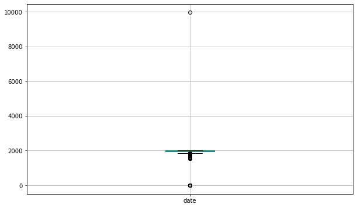
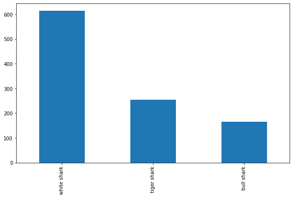
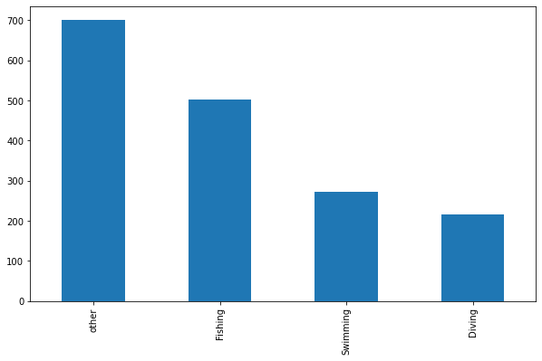

#     

#                                                 PROJECT-SHARK

## OBJETIVO DEL PROYECTO

Conocer las especies que más ataques producen, cuantos son mortales y desglosar los ataques mortales por las actividades donde más incidentes hay.

## PASOS A SEGUIR...

1) Se va a limpiar el dataframe original donde están todos los datos, extraídos de este [SHARK LINK!](https://www.kaggle.com/datasets/teajay/global-shark-attacks).

2) Solamente se ha podido eliminar las dos columnas unnamed que cumplían los criterios señalados de más del 80% nulos.

3) Se han tratado de limpiar todas las columnas lo mejor posible utilizando principalmente funciones con regex para filtrar los datos y dejarlas lo más limpias posibles.

    3.1) Primero se han limpiado los duplicados lo cual ha dejado las filas aproximadamente en unas 6300, cifra próxima al número de filas minimas permitidas que eran 6000.

    3.2) Criterios utilizados por columnas. En todas se han limpiado nulos y se ha dejado principalmente como alternativa en textos unkwnow.

    3.3) Vamos a repasar las columnas:
    En la columna DATE se ha utilizado una función para dejar solo las cifras de 4 digitos y se ha pasado esta columna a enteros.

    En la columna CASENUMBER se ha utilizado una función para igualar las fechas y dejar en los casos donde la fecha no fuera clara el formato 0000.00.00. Postetiormente estas columnas se han copiado en CASENUMBER1 Y CASENUMBER2.

    En la columna AGE se ha usado una función que sacaba la media donde aparecían varios numeros y a los string más habituales se le ha dado un valor como young 18.5. En el caso de lo que no entraba en la búsqueda se le ha puesto el valor de 0.

    En la columna TYPE se ha pasado una función para afinar la string Boat.

    3En la columna YEAR  se le ha dado un tratamiento parecido a AGE pero solo con una busqueda por 4 digitos y lo que se saliera de eso dejarlo como desconocido.

    Las columnas COUNTRY, AREA, LOCATION, INVESTIGATOR OR SOURCE solamente hemos realizado una limpieza superficial quitando algunos caracteres extraños o quitando string que hemos detectado como habituales.

    En la columna ACTIVITY hemos cogido los valores más habituales y les hemos dado formato, el resto los hemos pasado a "other".

    La columna NAME se le ha dado un tratamiento también superficial limpiando algunas palabras habituales con significado genérico por "unkwnow".

    La columna SEX tenía pocos valores por lo que se ha realizado una limpieza más manual cambiando directamente los 4 valores erroneos.

    En la columna INJURTY he decido dejar solo 2 valores ""FATAL" e "INJURY". Lo mismo en la columna FATAL(y/n) con solo "Y" o "N".

    En la columna TIME se ha dejado el formato 00:00 y se ha modificado por una función los rangos de tiempo más usuales por una hora concreta y las desconocidas por 00:00.

    En la columna SPECIES se ha pasado un función para dejar solo la palabra delante de shark y shark.

    Las columnas PDF, HREF,HREF_FORMULA Y ORIGINAL NUMBER no las he tocado ya que no las he considerado lo suficientemente importantes para una limpieza.

4) Se ha detectado si había datos constantes o con baja varianza pero no se ha detectado ninguno.

5) Se ha trazado los outliers sobre la columna de DATE y gtras aplicar la formula me han salido que los outliers superiores estaban en 2099. Este dato no tenia sentido por lo que se ha establecido el outlier superior en 2022 y el inferior en 1846.
    Hemos pasado de 6312 a 6121 filas.

6) Se han optimizado los tipos de datos y se ha guardado el fichero en un csv nuevo.

## EXPOSICION DE LOS DATOS

Para las conclusiones hemos eliminado las columnas donde no había especies de tiburones ya que eso falseaba el estudio y nos hemos quedado con unas 1500 filas. Ya que nuestra principal fuente de información son las especies y las actividades para sacar conclusiones.

Sobre las conclusiones obtenidas podemos indicar que los 3 tiburores con más tipos de ataque son:

### Tiburon blanco  
### Tiburon Tigre 
### Tiburon Toro 

Nada nuevo bajo el mar, suelen ser los más agresivos y con una mordida más poderosa.

Las cuatro actividades donde más ataques se han producido son las siguientes. Hemos dejado other como computo de muchas actividades menores:

Podemos saber que de todos los ataques aproximadamente el 15% han sido fatales y que dentro de las actividades principales el 26% de los mismos han sido fatales. Y si lo desglosamos por actividad.

### FISHING 

El 9% de los ataques en Pesca son mortales.
De estos, el 29% son realizados por tiburon blanco, 10% por tiburon tigre, el 8% por tiburon toro. Vemos hay un 19% más de ataques.
Podemos apreciar que no hay demasiados ataques mortales en esta actividad y que el tiburon blanco saca bastante ventaja a sus perseguidores.

### SWIMMING 

El 36% de los ataques en Natación son mortales.
De estos, el 24% son realizados por tiburon blanco, 14% por tiburon tigre, el 14% por tiburon toro.
En este caso la mortandad es bastante alta pero los ataque se distribuyen más entre los tipos de tibuores.

### DIVING 

El 17% de los ataques en Diving son mortales.
De estos, El 40% son realizados por tiburon blanco, 13% por tiburon tigre, el 4% por tiburon toro.
Aquí las mortandas está entre las dos anteriores y el tiburon blanco saca bastante ventaja al resto.

### OTROS 

El 11% de los ataques en Other son mortales.
De los cuales, El 34% son realizados por tiburon blanco, 13% por tiburon tigre, el 8% por tiburon toro.
En este grupo se encuentras ataques de todo tipo fuera de las actividades principales por lo que no podemos sacar demasiadas conclusiones pero por volumen he decidido dejarlo para tener el dato.

### CONCLUSION FINAL

Parece claro que el principal devorador de hombres es el tiburon blanco aunque la gran cantidad de desconocidos dentro de la columna de especies deja este dato en cuarentena.
Habría que tener en cuenta que posiblemente los ataques por especies desconocidas pertenecen a tibures no blancos, ya que estos últimos, son más conocidos y fácilmente identificables.
Lo que si parece claro es que la mortandad es mayor cuanto más está expuesto el sujeto en la actividad. Como vemos la natación es la que más mortandad tiene.

